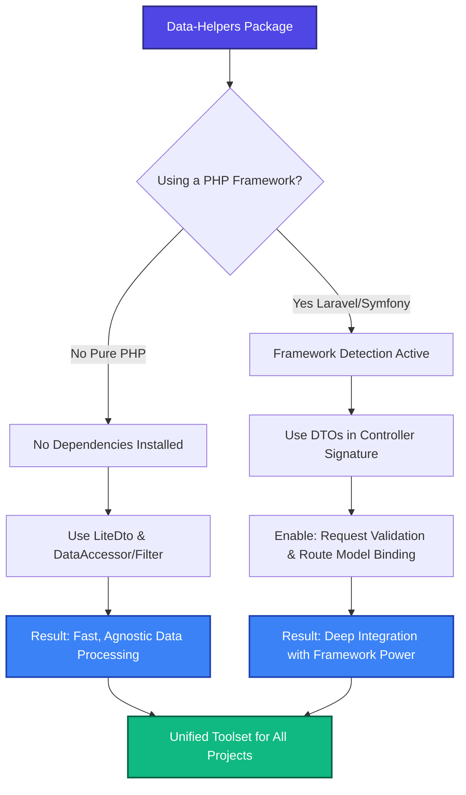

<div align="center" style="margin-bottom: 2rem;">
  <a href="https://event4u.app">
    
  </a>
</div>

Data Helpers is a **framework-agnostic PHP library with deep framework integration** – get the power of framework-specific solutions without the lock-in. Works standalone in **Pure PHP** or with **deep integration** for Laravel and Symfony. It provides data transformation with templates, type-safe DTOs, dot notation access, wildcard support and utility helpers for common operations.

## What is Data Helpers?

Data Helpers is a comprehensive toolkit for working with data in PHP applications. **At its core:** Data mapping and DTOs for transforming and structuring data.

### Core Components

- **DataMapper** - Transform data structures with templates and pipelines (40+ built-in filters)
- **SimpleDto & LiteDto** - Type-safe, immutable Data Transfer Objects. Framework-agnostic with optional deep integration for Laravel/Symfony

### Data Manipulation Tools

- **DataAccessor** - Read nested data with dot notation and wildcards
- **DataMutator** - Modify nested data structures safely
- **DataFilter** - Query and filter data with SQL-like API

### Utility Helpers

- **MathHelper** - Precision math operations using bcmath (add, subtract, multiply, divide, modulo, powerOf, squareRoot, compare, min, max, sum, average, product, time conversions)
- **EnvHelper** - Type-safe environment variable access with framework detection (get, has, string, integer, float, boolean, array)
- **ConfigHelper** - Singleton configuration manager with framework detection and dot notation (getInstance, get, getBoolean, getInteger, getFloat, getString, getArray, has, set, reset)
- **DotPathHelper** - Dot notation path utilities with wildcard support (segments, buildPrefix, isWildcard, containsWildcard)
- **ObjectHelper** - Deep object cloning with recursion control (copy)

## Quick Example

```php
// From this messy API response...
$apiResponse = [
    'data' => [
        'departments' => [
            ['users' => [['email' => 'alice@example.com'], ['email' => 'bob@example.com']]],
            ['users' => [['email' => 'charlie@example.com']]],
        ],
    ],
];

// ...to this clean result in a few lines
$accessor = new DataAccessor($apiResponse);
$emails = $accessor->get('data.departments.*.users.*.email');
// $emails = ['alice@example.com', 'bob@example.com', 'charlie@example.com']
```

## Why Use Data Helpers?

### Stop Writing Nested Loops

Without Data Helpers, you need to write verbose code with multiple loops and null checks:

```php
// Without Data Helpers
$emails = [];
foreach ($data['departments'] ?? [] as $dept) {
    foreach ($dept['users'] ?? [] as $user) {
        if (isset($user['email'])) {
            $emails[] = $user['email'];
        }
    }
}

// With Data Helpers
$emails = $accessor->get('departments.*.users.*.email');
```

### Transform Data Structures with Ease

Map between different data formats, APIs or database schemas without writing repetitive transformation code:

```php
use event4u\DataHelpers\DataMapper;

$source = [
    'profile' => ['name' => 'Alice', 'contact' => ['email' => 'alice@example.com']],
    'orders' => [['amount' => 100], ['amount' => 200], ['amount' => 150]],
];

$result = DataMapper::source($source)
    ->template([
        'user_name' => '{{ profile.name }}',
        'user_email' => '{{ profile.contact.email }}',
        'order_count' => '{{ orders | count }}',
        'order_amount_total' => '{{ orders.*.amount | sum }}',
    ])
    ->map()
    ->getTarget();
// $result = ['user_name' => 'Alice', 'user_email' => 'alice@example.com', 'order_count' => 3, 'order_amount_total' => 450]
```

### Type-Safe and Well-Tested

- PHPStan Level 9 compliant
- 2900+ tests with comprehensive coverage
- Works reliably with arrays, objects, Collections, Models, JSON and XML

### 🎯 Framework-Agnostic + Deep Integration

**The best of both worlds:** Use Data Helpers as a standalone library in pure PHP, or leverage deep framework integration for Laravel and Symfony – without framework lock-in.



#### Pure PHP - Zero Dependencies

Works out of the box with:
- ✅ **Pure PHP** - Arrays, objects, JSON, XML
- ✅ **Any Framework** - No framework-specific code required
- ✅ **Portable** - Move between frameworks without code changes

```php
// Works everywhere - no framework needed
$dto = UserDto::fromArray($_POST);
$accessor = new DataAccessor($apiResponse);
$emails = $accessor->get('data.departments.*.users.*.email');
```

#### Optional Deep Integration

Framework support is automatically detected at runtime:

**Laravel 9+**
- ✅ **Controller Injection** - Automatic validation & filling
- ✅ **Eloquent Integration** - fromModel(), toModel()
- ✅ **Laravel Attributes** - WhenAuth, WhenCan, WhenRole
- ✅ **Artisan Commands** - make:dto, dto:typescript
- ✅ **Collections & Models** - Full support

**Symfony 6+**
- ✅ **Controller Injection** - Automatic validation & filling
- ✅ **Doctrine Integration** - fromEntity(), toEntity()
- ✅ **Symfony Attributes** - WhenGranted, WhenSymfonyRole
- ✅ **Console Commands** - make:dto, dto:typescript
- ✅ **Collections & Entities** - Full support

**Doctrine 2+**
- ✅ **Entity Integration** - fromEntity(), toEntity()
- ✅ **Collections** - Full support

**The Power:** Get framework-specific features when you need them, without framework dependencies in your core code.

📖 **[Laravel Integration Guide](/data-helpers/framework-integration/laravel/)** • [Symfony Integration Guide](/data-helpers/framework-integration/symfony/)**

### Blazing Fast Performance

DataMapper is significantly faster than traditional serializers for Dto mapping:

- Up to 3.7x faster than Symfony Serializer
- Optimized for nested data structures
- Zero reflection overhead for template-based mapping
- See [Performance Benchmarks](/data-helpers/performance/benchmarks/) for detailed comparison

## Key Features

### DataAccessor
- Dot notation path access
- Wildcard support for nested arrays
- Type-safe getters
- Collections support (Laravel/Doctrine)
- JSON and XML support

### DataMutator
- Safe nested value setting
- Merge operations
- Unset operations
- Wildcard mutations

### DataMapper
- Template-based mapping
- Pipeline filters (40+ built-in)
- Reverse mapping
- Query builder
- GROUP BY and aggregations
- Custom operators

### DataFilter
- SQL-like query API
- WHERE, ORDER BY, LIMIT, OFFSET
- Custom operators
- Chainable methods

### SimpleDto
- Immutable Dtos
- 20+ built-in casts
- Validation system (22+ attributes)
- Property mapping
- Conditional properties (18 attributes)
- Lazy properties
- Computed properties
- Collections support
- TypeScript generation
- Framework integration

## Requirements

- PHP 8.2 or higher
- No required dependencies
- Optional framework integrations:
  - Laravel 9+
  - Symfony 6+
  - Doctrine 2+

## Installation

Install via Composer:

```bash
composer require event4u/data-helpers
```

See [Installation](/data-helpers/getting-started/installation/) for detailed setup instructions.

## Next Steps

- [Installation](/data-helpers/getting-started/installation/) - Install and configure Data Helpers
- [Quick Start](/data-helpers/getting-started/quick-start/) - Get started in 5 minutes
- [Core Concepts](/data-helpers/core-concepts/dot-notation/) - Learn the fundamentals
- [Examples](/data-helpers/examples/) - Browse 90+ code examples

## Comparison with Similar Libraries

Data Helpers offers several advantages over comparable projects:

- **🎯 Framework-Agnostic + Deep Integration** - Pure PHP with zero dependencies, optional deep Laravel/Symfony integration, no framework lock-in
- **Zero dependencies** - No required dependencies, optional framework integrations
- **Comprehensive** - 5 main components covering all data manipulation needs
- **Well-tested** - 2900+ tests with PHPStan Level 9 compliance
- **High performance** - Up to 3.7x faster than traditional serializers
- **Rich feature set** - 40+ filters, 20+ casts, 22+ validation attributes, 18 conditional attributes

See [Performance Comparison](/data-helpers/performance/comparison/) for detailed benchmarks.

## Support

- [GitHub Issues](https://github.com/event4u-app/data-helpers/issues) - Report bugs or request features
- [GitHub Discussions](https://github.com/event4u-app/data-helpers/discussions) - Ask questions and share ideas
- [Examples](/data-helpers/examples/) - Browse 90+ code examples
- [API Reference](/data-helpers/api/) - Complete API documentation

## License

Data Helpers is open-source software licensed under the [MIT license](https://opensource.org/licenses/MIT).

